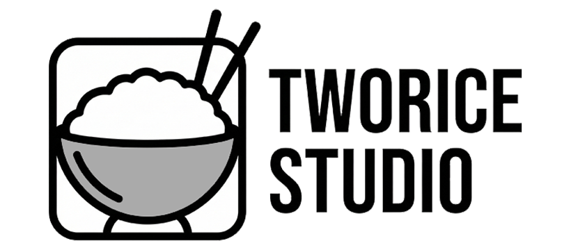

  
   
   

  # ✦ IT Journey
  
  **Hành trang vững chắc cho sinh viên CNTT & Người chuyển ngành.**
  
  

    <a href="https://it-journey.vercel.app">🌐 Truy cập Web</a>
    ·
    <a href="https://github.com/NgaiCong/ITJourney/issues">🐛 Báo lỗi</a>
    ·
    <a href="https://github.com/NgaiCong/ITJourney/pulls">🤝 Đóng góp</a>
  

---

## 👋 Giới thiệu (About Us)

> *"Lạc lối trong ma trận công nghệ? Chúng tôi ở đây để dẫn đường."*

**IT Journey** là dự án cộng đồng phi lợi nhuận, được xây dựng với sứ mệnh hỗ trợ các bạn sinh viên IT, đặc biệt là những bạn **"mất gốc"** hoặc đang loay hoay tìm định hướng. 

Không lý thuyết suông, không "lùa gà". Chúng tôi cung cấp một lộ trình thực chiến, trực quan và hiện đại để giúp bạn tái thiết lập nền tảng kỹ thuật từ con số 0 đến khi làm chủ công nghệ.

## 🎯 Mục tiêu dự án

Dự án này sinh ra để giải quyết 3 vấn đề lớn của sinh viên:
1.  **Mông lung:** Không biết học gì, bắt đầu từ đâu.
2.  **Hổng kiến thức:** Học lan man nhưng thiếu nền tảng (DSA, OS, Network).
3.  **Thiếu thực tế:** Chỉ biết code theo tutorial mà không hiểu bản chất engineering.

## ✨ Tài nguyên cung cấp

- **🗺️ Interactive Roadmap**: Lộ trình học tập 12 tháng, từ C++ cơ bản đến Full-stack Engineer.
- **📚 Wiki Knowledge Base**: Kho tàng kiến thức tập trung, được trình bày theo phong cách hiện đại.
- **🛠️ Tools & Resource**: Tổng hợp các công cụ, tài liệu chọn lọc nhất cho dev.
- **🤝 Community**: Kết nối, chia sẻ và cùng nhau tiến bộ.

## 🛠️ Công nghệ sử dụng

Web được xây dựng theo tiêu chuẩn "Luxurious Minimalism" với công nghệ mới nhất để các bạn tham khảo source code:

| Core | Visual | Experience |
| :--- | :--- | :--- |
|  |  |  |
|  |  |  |

## 🚀 Đóng góp (Contributing)

Đây là dự án mở (Open Source), chúng tôi rất hoan nghênh sự đóng góp của cộng đồng!
Nếu bạn thấy hay, hãy để lại một ⭐ **Star** để ủng hộ team nhé!

---

  
Built with ❤️ by <a href="https://github.com/NgaiCong">NgaiCong</a>

